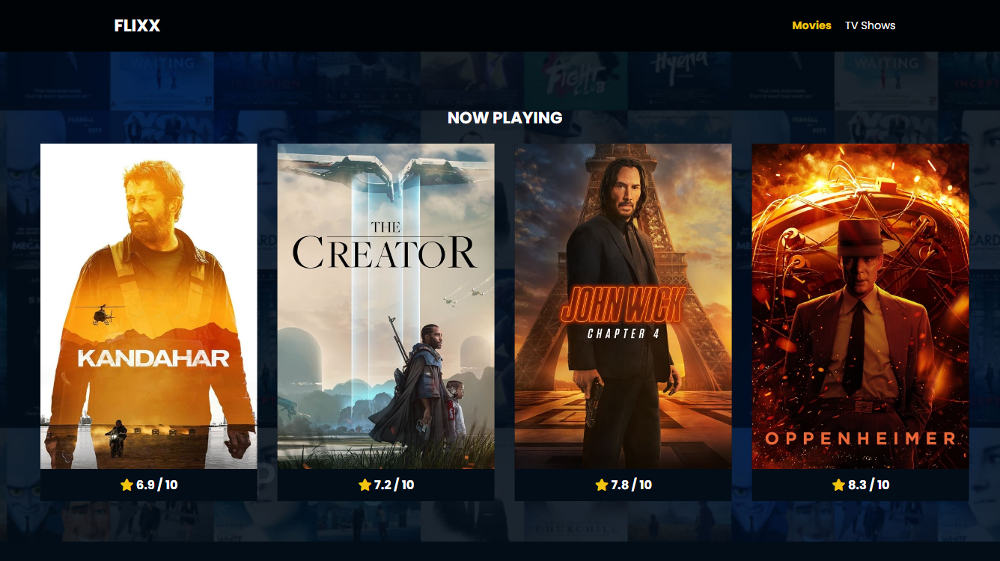
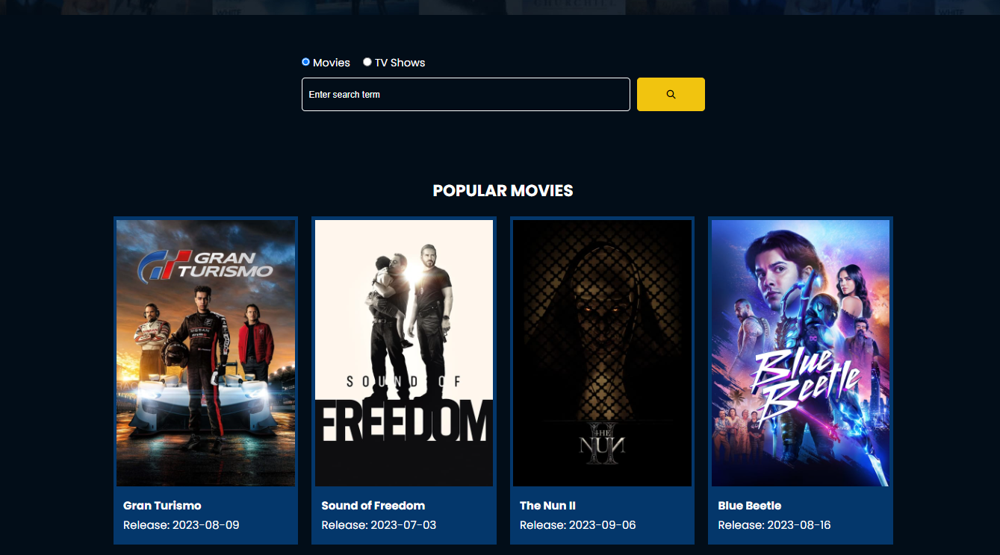
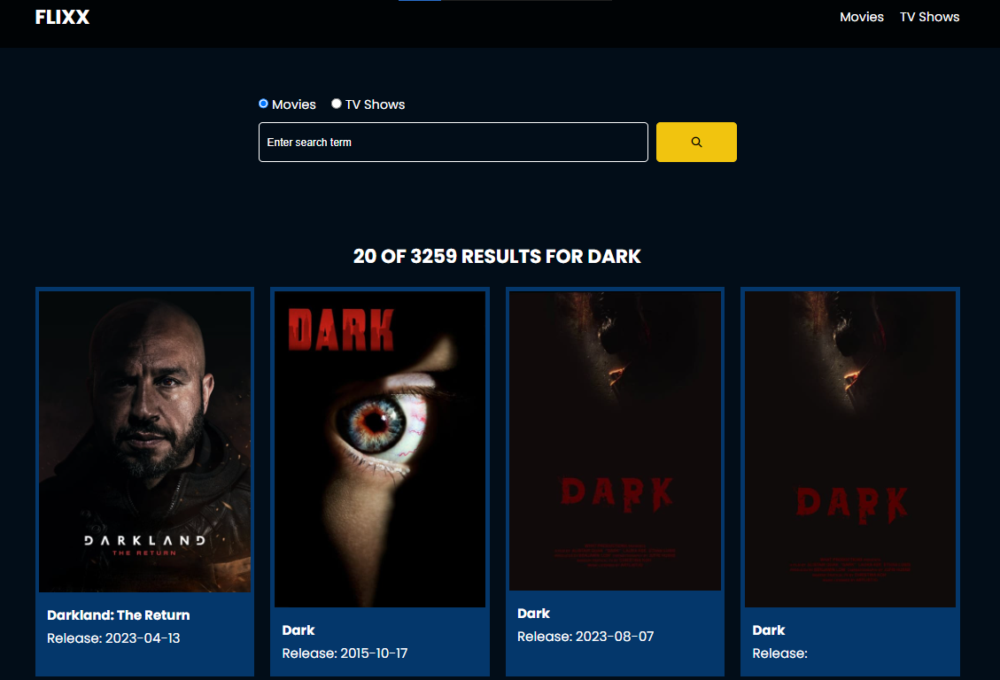

# Flixx App

Demo: https://flixx-app-kd.netlify.app/

Movie and TV Show info app with Vanilla JS that uses the <b>version 3</b> of <a href="https://developers.themoviedb.org/3">TMDB</a>

It includes the most popular movies and TV shows with detail pages, a search box for movies and shows with full pagination and a slider for movies that are currently playing in theaters. The slider uses the <a href="https://swiperjs.com/">Swiper</a> library.

